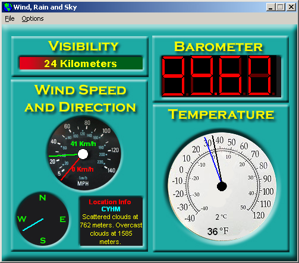



## Wind, Rain and Sky

### Description

This is the successor to my GetMetar Weather program. I spiffed up the interface and the dynamics within it. It does the same things as GetMetar, but looks better. There is now a location wizard for selecting locations and the locations are now in a Microsoft Access database. Thanks to everyone for all your support! Don't forget to vote! (If download does not work, go to my website at http://binsurf.net without the www.)
 
### More Info
 

             |
---                |---
**Submitted On**   |2002-12-20 13:33:12
**By**             |[James W\. Manning](https://github.com/Planet-Source-Code/PSCIndex/blob/master/ByAuthor/james-w-manning.md)
**Level**          |Intermediate
**User Rating**    |5.0 (25 globes from 5 users)
**Compatibility**  |VB 6\.0
**Category**       |[Complete Applications](https://github.com/Planet-Source-Code/PSCIndex/blob/master/ByCategory/complete-applications__1-27.md)
**World**          |[Visual Basic](https://github.com/Planet-Source-Code/PSCIndex/blob/master/ByWorld/visual-basic.md)
**Archive File**   |[Wind,\_Rain15170212222002\.zip](https://github.com/Planet-Source-Code/james-w-manning-wind-rain-and-sky__1-41742/archive/master.zip)

